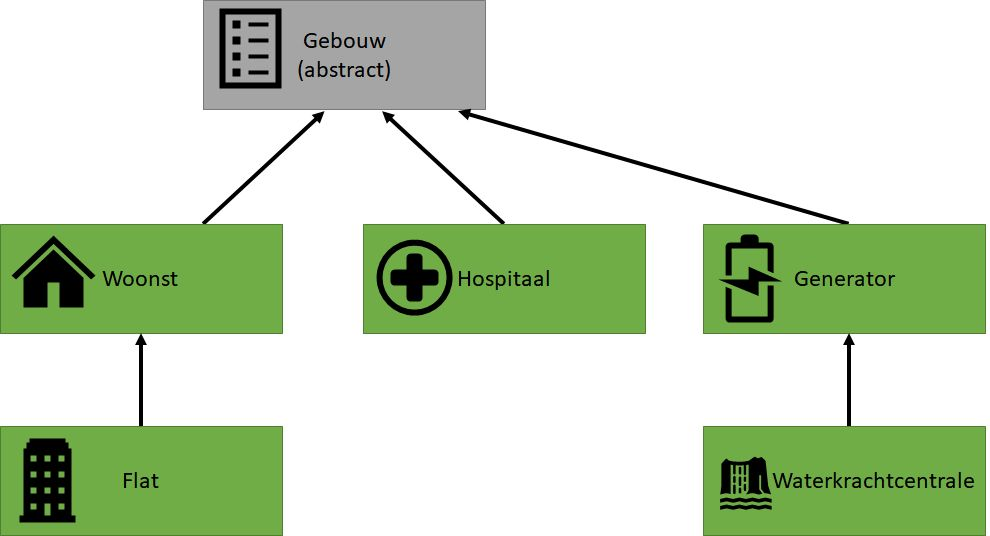

De enclave die je moet uitbouwen zal bestaan uit enkele essentiële gebouwen. We willen alle gebouwen volgens een zelfde concept uitwerken zodat onze stad zo modulair mogelijk wordt. 

# Abstracte klasse Gebouw

Deze klasse is...je raadt het nooit. Abtract.

De klasse heeft 3 autoproperties:
* Ieder gebouw heeft een X en Y locatie (via int property) waar het gebouw zal verschijnen op de kaart.
* Ieder gebouw heeft een Naam (``string``)

De klasse heeft een abstracte methode ``PrintGebouw``. Deze methode geeft niets terug en heeft geen parameters nodig.

De klasse override ``ToString`` en zal de volgende tekst teruggeven (veronderstel dat het gebouw als Naam ``Hospitaal`` heeft op locatie (3,4 )):

```text
Hospitaal (locatie: 3, 4)
```

De klasse heeft géén default constructor. Enkel een overloaded constructor die Naam, X en Y als parameters aanvaardt.

# Basis gebouwen klaarmaken


Maak de klassen van het volgende schema:


Iedere groene klasse heeft:
* Een overloaded constructor die X en Y coördinaat vraagt
* Override ToString en zal extra informatie over het gebouw geven (verzin zelf wat tekst per klasse). Merk op dat de ToString implementatie van de parent-klasse(n) nog steeds moet uitgevoerd worden.
* Implementeert de ``PrintGebouw`` methode. Voorlopig is de code in al deze klasse quasi dezelfde. De aanroep van deze methode zal resulteren in één karakter dat op het scherm verschijnt op de coördinaten X en Y.
  * Bij een woonst is dit karakter een ``w``
  * Bij een flat is dit karakter een ``W``
  * Bij een Hospitaal is dit karakter een ``H``
  * Bij een Genererator is dit karakter een ``g``
  * Bij een Waterkrachtcentrale is dit karakter een ``G``

# Maak een enclave

Test of je enclave werkt door volgende code in je main te steken:
```csharp
List<Gebouw> enclave=new List<Gebouw>();
enclave.Add(new Hospitaal("Sint Vincentius",4, 5));
enclave.Add(new Woonst("Tims shack",1, 1));
enclave.Add(new Generator("batteryshed 1",1, 2));

foreach(var gebouw in enclave)
{
    gebouw.PrintGebouw();
}
```

Dit zou volgende uitvoer moeten geven:

```
wg


   H
```

# Extra 1
Voeg kleur toe. Zorg ervoor dat ieder type gebouw in een andere kleur op het scherm komt. Dus de woonst geeft bijvoorbeeld een blauwe w.Een hospitaal een rode H.

# Bonuspoints:
Maak ook een Straat-klasse en voorzie wat straten in je enclave. 

Mail je coolste stad naar mij met straten en gebouw. Mail me:
* Een screenshot
* Je code in zip

Je prijs? Dit moet ik nog bepalen!