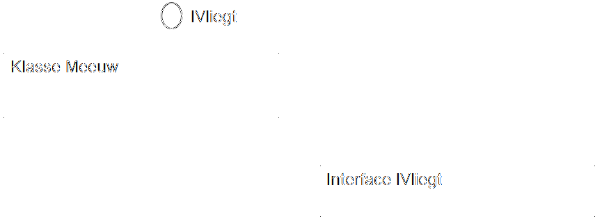


> Delen van deze sectie komen uit het voortreffelijke handboek "Programmeren in C#" (2nd Edition door Douglas Bell en Mike Parr, ISBN:9789043032421)

In C# worden interfaces gebruikt om de uitwendige verschijningsvorm van een klasse te beschrijven. Vaak zijn klassen grote, complexe stukken code bestaande uit tientallen tot honderden methoden en properties. Wanneer we een dergelijke klasse moeten gebruiken boeit meestal enkel de uitwendige, of publieke, vorm: dit zijn de enige zaken waar je als externe gebruiker van de klasse mee kunt praten. Interfaces zijn als het ware stempels die we op een klasse kunnen plakken om zo te zeggen "deze klasse gebruikt interface xyz". Gebruikers van de klasse hoeven dan niet de hele klasse uit te spitten en weten dat alle klassen met interface xyz dezelfde publieke properties en methoden hebben. 

**Merk op dat dit niets met grafische user interfaces te maken heeft in dit geval.**

Een interface is niet meer dan een belofte: het zegt enkel welke publieke methoden en properties de klassen bezit. Het zegt echter niets over de effectieve code/implementatie van deze methoden en properties.

Volgende code toont hoe we een interface definiëren:
```csharp
interface ISuperHeld
{
    void SchietLasers();
    int VerlaagKracht(bool isZwak);
    int Power{get;set;}
}
```
Enkele opmerkingen:
* Het woord ``class`` wordt niet gebruikt, in de plaats daarvan gebruiken we ``interface``.
*  Het is een goede gewoonte om interfaces met een I te laten starten in hun naamgeving
*  Methoden en properties gaan niet vooraf van ``public``: interfaces zijn van nature net publiek, dus alle methoden en properties van de interface zijn dat bijgevolg ook.
*  Er wordt geen code/implementatie gegeven: iedere methode eindigt ogenblikkelijk met een puntkomma.


Het is in de klassen dat we nu vervolgens verplicht zijn deze methode en properties te implementeren.

>**Een interface is een beschrijving hoe een component een andere component kan gebruiken, zonder te zeggen hoe dit moet gebeuren. De interface is met andere woorden 100% scheiding tussen de methode/Property-signatuur en de eigenlijke implementatie ervan.**


## Interface regels
* Je kan geen  membervariabelen (fields) declareren in een interface (dat hoort bij de implementatie)
* Je kan geen constructor declareren
* Je kan geen access specificeren (public, protected, etc): alles is public
* Je kan nieuwe types (bv enum, struct) in een interface declareren.
* Een interface kan niet overerven van een klasse, wel van een andere interface.


## Interfaces en klassen
We kunnen nu aan klassen de stempel ISuperHeld geven zodat programmeurs weten dat die klasse geagarandeert de methoden ``SchietLasers``, ``VerlaagKracht`` en de property ``Power`` zal hebben.

Volgende code toont dit:
```csharp
class Zorro: ISuperHeld
{
    public void RoepPaard(){...}
    public bool HeeftSnor{get;set;}
    public void SchietLasers() //interface ISuperHeld
    {
        Console.WriteLine("pewpew");
    }
    int VerlaagKracht(bool isZwak)//interface ISuperHeld
    {
        if(isZwak) return 5;
        return 10;
    }
    int Power{get;set;} //interface ISuperHeld
}
```
Zolang de klasse Zorro niet exact de interface inhoud implementeert zal deze klasse niet gecompileerd kunnen worden.

## Interface notatie

Een "lolly" op een klein geeft aan dat deze een bepaalde interface heeft. In volgende tekening hebben we een klasse Meeuw en een interface IVliegt. We gebruiken de UML notatie voor een interface om aan te geven dat de Meeuw klasse de interface IVliegt heeft:



## Is keyword met interfaces
We kunnen``is`gebruiken om te weten of een klasse een specifieke interface heeft.

Stel:
```csharp
interface IDeletable{ ...};

class Book: IDeletable { ... };

class Person { ... };
```

In actie:
```csharp
Person tim= new Person();
Book gameofthrones = new Book();

if(gameofthrones is IDeletable)
{
    Console.WriteLine("I can delete game of thrones");
}
if(tim is IDeletable)
{
    Console.WriteLine("I can delete tim");
}
```

Ouput: ``I can delete game of thrones``.


## Meerder interfaces
Een nadeel van overerving is dat een klasse maar van 1 klasse kan overerven. Een klasse mag echter wel meerdere interfaces met zich meedragen:
```csharp
interface ISuperHeld{...}
interface ICoureur{...} 
class Man {...}

class Zorro:Man, ISuperHeld
{...}

class Batman:Man, ISuperHeld, ICoureur 
{...}
```

Ook mogen interfaces van elkaar overerven:
```csharp
interface IGod:ISuperHeld
{...}
```


# Why should I care?


In kleine projecten lijken interfaces wat overkill, en dat zijn ze vaak wel. Van zodra je een iets complexer project krijgt met meerdere klasse die onderling met elkaar allerlei zaken moeten doen, dan zijn interfaces je dikke vrienden!
Je hebt misschien al over de [SOLID programmeerprincipes gehoord](https://en.wikipedia.org/wiki/SOLID)? 

And if not, niet erg. Samengevat zegt SOLID dat we een bepaalde hoeveelheid abstractie inbouwen enerzijds (zodat we niet de gore details van klassen moeten kennen om er mee te programmeren) anderzijds dat er een zogenaamde 'separation of concerns' (SoC) moet zijn (ieder deel/klasse/module van je code heeft een specifieke opdracht).

Met interfaces kunnen we volgens SOLID programmeren: het boeit ons niet meer wat er in de klasse zit, we kunnen gewoon aan de interfaces van een klasse zien wat hij kan doen. Handig toch!

Ok, als de helft van bovenstaande zinnen je wat filosofisch overkwamen, don't worry maar geloof ons: als je tegen interfaces kan programmeren i.p.v. klasse dan zal je code vaak een pak beter worden in de long run.

Toch nog voorbeeld?
Beeld je in dat je een complexe klasse ``DiskWriter`` hebt die je programma gebruikt om data van en naar de harde schijf te schrijven. De klasse implementeert een interface ``IData`` die twee methoden heeft (``ReadData()`` en ``WriteData``).
Als je later beslist om je data naar een online server te schrijven en niet naar de harde schijf, dan kan je gewoon die klasse schrijven (bv. ``InternetWriter``) en vervolgens ook de ``IData`` interface laten implementeren. 
Al je andere code moet dan niet aangepast worden! Ze (je andere klassen) kunnen gewoon blijven zeggen ``ReadData`` en ``WriteData`` en weten misschien zelfs niet dat hun  data niet meer naar de HD maar naar het internet wordt gestuurd.
Mooi toch!

# Kennisclip


* [Interfaces](https://ap.cloud.panopto.eu/Panopto/Pages/Viewer.aspx?id=6c32cd08-980c-4fe1-9be8-aba40101be31)
