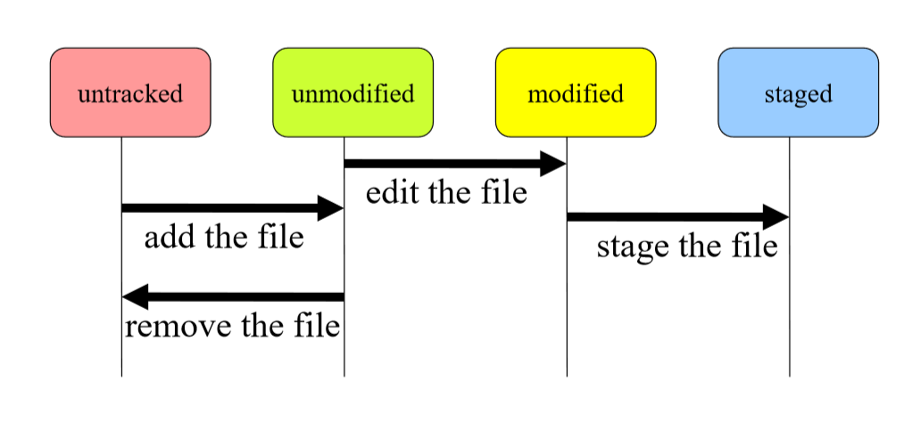
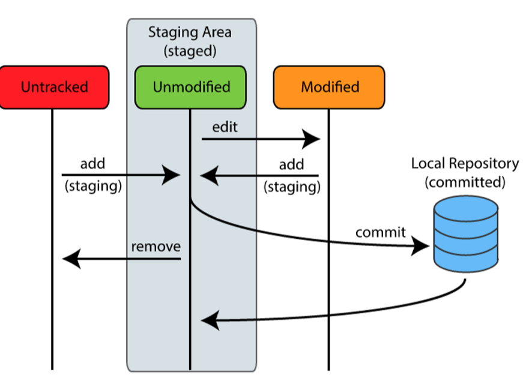

# Git

In dit hoofdstuk geven we een summier overzicht over git. Bedoeling is dat je git kan gebruiken om versiebeheer van eigen **lokale** projecten te hebben. Met andere woorden, het zal je er toe in staat stellen om een historiek van je project(en) te hebben.

Een [goede uitleg vind je hier](https://www.sitepoint.com/git-for-beginners/).

## File lifecycle
  

## Belangrijkste commando's

* ``git init``: in de huidige folder een git repository aanmaken (een verborgen ``.git`` folder) waarin vanaf nu alle te volgen veranderingen zullen bewaard worden. Indien je deze hoofdfolder verplaatst (inclusief de ``.git`` folder) dan zal deze repository mee verhuizen.
* git add
  * Bij bestanden en folder die je nog niet volgde: vanaf nu zullen veranderingen in dit bestand of folder door git gevolgd worden
  * Bij reeds gevolgde bestanden: de veranderingen in dit bestand zullen bij de eerstvolgende commit toegevoegd worden.

* ``git commit``: alle te volgen veranderingen (via ``add``) worden naar een commit geschreven. Je maakt als het ware een snapshot van de huidige staat van je gevolgde bestanden.   
* ``git status``: kijk hoe je repo er voor staat. Zijn er veranderingen die je nog niet hebt gecommit, etc?

