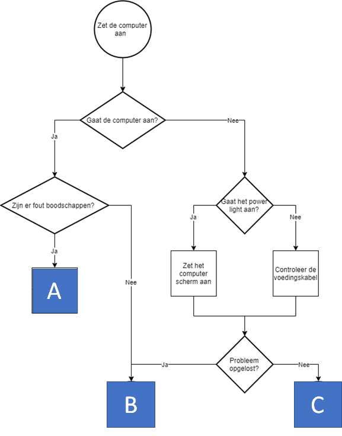
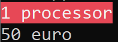
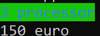

# Opgave vaardigheidsproef 2019-2020, deel 1 - IT Helpdesk

## Introductie
Maak een applicatie die de IT-helpdesk medewerkers kunnen gebruiken om bij gebruikers computerproblemen op te lossen.

## Stap 1- Flowchart 
Het programma implementeert volgende flowchart:

* De gebruiker dient steeds met "ja" of "nee" te antwoorden bij de vragen.
* De applicatie begint met "Zet de computer aan." En stelt dan de eerste vraag ("Gaat de computer aan").
* Na ieder antwoordt wordt het scherm leeggemaakt.
Finaal bereikt de gebruiker dan een van de onderstaande fasen A,B of C, die verderop in de opgave worden uitgelegd.

## Stap 2- Fase A

In fase A gebeurt het volgende:

1. De gebruiker dient de foutcode als geheel getal in te voeren. Dit moet een getal tussen 0 en 9 zijn. Bij alle andere getallen (bijvoorbeeld -1 of 14) verschijnt er "Los het dan zelf op he!" en sluit het programma zich af.
2. Wanneer een correct getal werd ingevoerd verschijnt er in RODE LETTERS de boodschap "Gelieve je computer gedurende X minuten af te zetten."

X is een getal dat berekend wordt als volgt:  
``vierkantswortel van (foutcode * 3)``
	
X verschijnt op het scherm met 1 cijfer na de komma.

## Stap 2 – Fase B

In fase B  verschijnt er op het scherm op het "Mooi zo, alles werkt."

Om de gebruiker aan te moedigen een werkende computer te hebben is er ook 25% kans dat hij een extra bonus krijgt. 

In 25% van de gevallen dat fase B wordt bereikt verschijnt er namelijk een tweede zin: “En u wint ook nog eens 1 jaar gratis IT support!”
De overige 75% keren dat fase B wordt bereikt verschijnt er enkel "Mooi zo, alles werkt." op het scherm.

## Stap 3- Fase C

* In deze fase wordt eerst wat meer informatie over de huidige computer getoond (merk op dat deze fase bij de klant op de computer eigenlijk moet uitgevoerd worden, maar doe maar alsof)

  Verkrijg via de Environment-bibliotheek het aantal processoren van de huidige computer (`` ProcessorCount``) en gebruik deze waarden om
  1. Indien er 1 processor in de computer zit komt er in witte letters op rode achtergrond op het scherm “1 processor”
  2. Indien er 2 of meer in zitten toon je het aantal processoren als getal met een groene achtergrond en blauwe letters, 

* Vervolgens berekent het programma de kostprijs voor de reparatie. Deze is 50€ per processor. Een computer met 5 of meer processoren zal altijd 200 euro kosten. Bereken de kost door het aantal processoren uit de vorige stap te gebruiken en toon dit op het scherm. 

Voorbeeld 1 fase C:
 

Voorbeeld 2 fase C:

* De gebruiker krijgt een bon voor een gratis reparatie indien hij een 64 bit computer gebruikt. Bevraag dit via de Environment-bibliotheek en toon "Hier een bon!" indien een 64 bit processor aanwezig is.