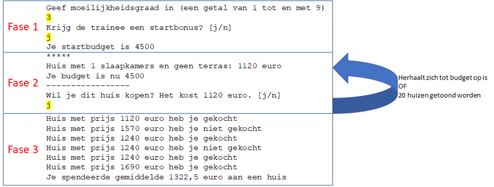

# Introductie- ImmoTrainer
Een firma die huisverkopers opleidt heeft je gevraagd om een trainingspakket te maken. Het pakket moet de trainees in staat stellen om te oefenen op het zo goed mogelijk kopen van huizen die op de markt verschijnen.

Er zijn twee gebruikers:
* De trainer: degene die het programma instelt aan de start
* De trainee: de persoon die de opleiding volgt en dus de training doet.

**Er hoeft geen rekening gehouden te worden met foute invoer van de gebruiker. De gebruiker voert enkel zaken in die toegestaan zijn.**

# Algemene werking
Het programma doorloopt een aantal fasen:
* Fase 1 (4punten): De trainer stelt de moeilijkheidsgraad in van het programma zodat het startbudget kan berekend worden
* Fase 2 (8 punten): De trainee krijgt huizen aangeboden (willekeurig) waar hij op kan bieden. Van zodra het budget op is wordt naar de volgende fase doorgegaan.
* Fase 3 (4 punten): De trainer én trainee krijgen te zien hoe goed de trainee het heeft gedaan

Achteraan is ook een aanvullende-opgave (2 punten waard) waar je eventueel al van bij de start rekening mee kunt houden.

##	Overzicht werking/output (geel gemarkeerd=invoer gebruiker)



## 1.2	Fase 1: Setup (4 punten)

* De moeilijkheidsgraad wordt gevraagd (een getal van 1 tot en met 9, hierop moet géén foutcontrole gebeuren).
* Er wordt gevraagd of de trainee een bonus krijgt (j of n) en dit wordt als bool bewaard.
* Een methode “BudgetGenerator” wordt aangeroepen. Deze zal een budget teruggeven dat je bewaard in het hoofdprogramma en nodig hebt in de volgende fasen.

Voorbeeld output 
```
Geef moeilijkheidsgraad in (een getal van 1 tot en met 9)
5  <-input user
Krijg de trainee een startbonus? [j/n]
j <-input user
Je startbudget is 4500
```

### 1.2.1	Methode BudgetGenerator

Output: geeft double terug  ( namelijk het berekende startbudget)

Input: 
1. De moeilijkheidsgraad als geheel getal, standaardwaarde = 5
2. De startbonus als bool, standaardwaarde = true

Werking:

Het basisbudget is 5000. Indien een startbonus wordt toegestaan komt hier 2500 bij. Per moeilijkheidsgraad gaat er 100 euro van het totaal budget af. 

Voorbeeld: 

moeilijkheidsgraad 5 en geen startbonus => budget = 5000 – (5*100) = 4500.

## Fase 2: Training (8 punten)
* Een loop wordt gestart, zolang de trainee budget heeft krijgt hij steeds een nieuw huis te zien dat hij kan kopen. Wanneer er 20 huizen getoond stopt de loop ook, ongeacht of de gebruiker nog budget over had of niet.
* De loop:
  * Het huidige budget wordt steeds opnieuw getoond
  * De prijs van een nieuw huis wordt gegenereerd in een methode “HuisPrijs”, de methode toont ook wat het huis heeft (qua kamers en terras)
  * De te betalen prijs wordt getoond.
  * De trainer kan beslissen om het huis te kopen of niet
    * Wanneer de trainee een huis koopt zal zijn budget verminderd worden met de prijs van het huidige huis. 
     * De gebruiker moet hiervoor j of n antwoorden op de vraag of hij dit huis wenst te kopen
  * Er wordt bijgehouden welke huizen de trainee wel én niet kocht alsook de prijs van ieder huis. Dit wordt in 2 arrays bewaard:
    * 1 array (double) zal de prijzen van ieder gegenereerd huis bijhouden 
    * 1 array (bool) zal bijhouden of de gebruiker het huis wel of niet kocht

Voorbeeld output (deels) (geel gemarkeerd = invoer gebruiker)

```
*****
Huis met 2 slaapkamers en geen terras: 1240 euro
Je budget is nu 4500
-----------------
Wil je dit huis kopen? Het kost 1240 euro. [j/n]
n <-input user
*****
Huis met 3 slaapkamers en met terras: 1810 euro
Je budget is nu 4500
-----------------
Wil je dit huis kopen? Het kost 1810 euro. [j/n]
j <-input user
*****
Huis met 2 slaapkamers en geen terras: 1240 euro
Je budget is nu 2690
-----------------
Wil je dit huis kopen? Het kost 1240 euro. [j/n]
j <-input user
*****
Huis met 1 slaapkamers en geen terras: 1120 euro
Je budget is nu 1450
-----------------
Wil je dit huis kopen? Het kost 1120 euro. [j/n]
```

###	Methode HuisPrijs

Output: geeft int terug  ( namelijk de prijs van het nieuwe huis)

Input:  geen

Werking:

* De methode genereert een huis:
  * Een huis heeft 1, 2 of 3 slaapkamers. Dit wordt willekeurig gegenereerd
  * Eén derde van de huizen (willekeurig) heeft een terras, de andere huizen niet
* De prijs wordt berekend
  * Ieder huis heeft als basisprijs 1000
  * Per slaapkamer komt er 120 euro bij
  * Een terras doet nog eens 450 euro er bij
* De methode toont een beschrijving van het huis alsook de prijs. Voorbeelden:
  * Huis met 2 slaapkamers en geen terras: 1240 euro
  * Huis met 1 slaapkamers en geen terras: 1120 euro
* De prijs wordt teruggegeven
 

##	Fase 3: Afsluiten (4 punten)
* In deze fase wordt een overzicht getoond van de gekochte én niet gekochte huizen. Gebruik hiervoor de twee arrays waarin je die informatie bijhield. Je toont telkens de prijs van het huis alsook of deze wel of niet werd gekocht.
* Na het overzicht wordt de gemiddelde prijs van de aangekochte huizen getoond m.b.v. een methode BerekenGemiddelde. Deze methode zal het gemiddelde berekenen en in het hoofdprogramma wordt deze dan in een zin getoond (zie voorbeeld output)

Voorbeeld output

```text
Huis met prijs 1240 euro heb je gekocht
Huis met prijs 1690 euro heb je niet gekocht
Huis met prijs 1120 euro heb je gekocht
Huis met prijs 1810 euro heb je niet gekocht
Huis met prijs 1810 euro heb je niet gekocht
Huis met prijs 1810 euro heb je gekocht
Huis met prijs 1120 euro heb je gekocht

Je spendeerde gemiddelde 1322,5 euro aan een huis
```

###	Methode BerekenGemiddelde

Output: geeft double terug  ( namelijk de gemiddelde prijs van de gekochte huizen)

Input:  

* een array van type bool die aangeeft (in volgorde) welke huizen wel en niet werden gekocht, 
* een array van type int die de prijzen van alle gegenereerde huizen bevat (in dezelfde volgorde als de andere array)


Werking:

Het gemiddelde wordt berekend van de prijzen van de huizen die wél werden gekocht. 


# Aanvullende opgave (2 punten)

Iedere fase (3 in totaal) wordt in een aparte methode geplaatst. In de main-methode mogen enkel deze 3 methode-fasen staan alsook eventuele variabelen die je nodig hebt om data tussen de methoden uit te wisselen.

