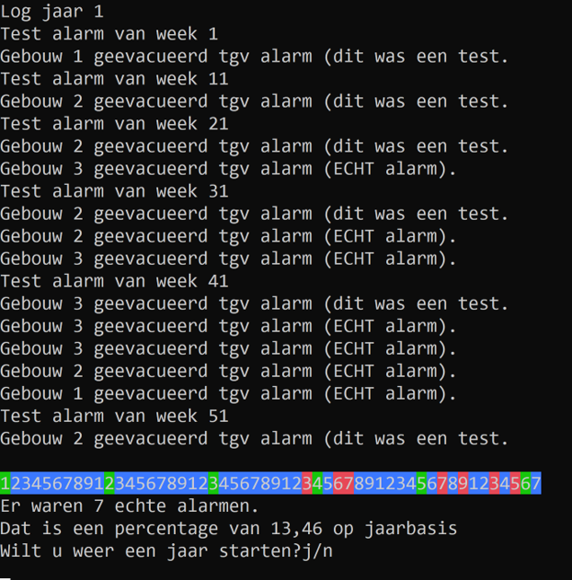
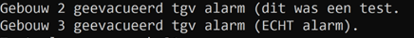
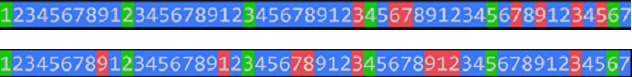
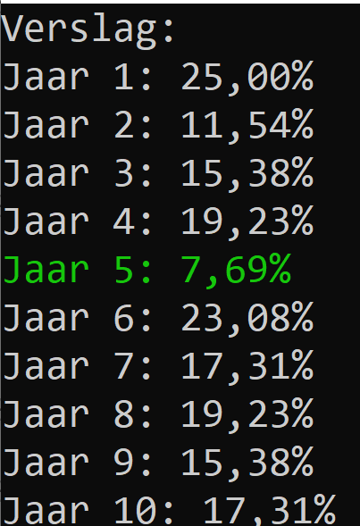

# Intro
Dit nooit meer. Tijdens een examen Java ging plots het brandalarm af. Alhoewel dit terecht was, heeft de PAP Hogeschool ons gevraagd om een verbeterde alarminstallatie te maken. De nieuwe installatie moet een beter logbook tonen en bijhouden van de echte en valse alarmen.

Punten verdeling:
* Hoofdprogramma 6p
* Methoden 10p
* Eindfase 2p
* Enums als extra 2p

# Werking
Het programma zal gedurende maximum 10 jaren steeds de 52 weken van een jaar doorlopen. Het programma zal iedere 10e week een testalarm starten. Doorheen het jaar zullen ook echte alarmen plaatsvinden. 
Aan het einde van ieder jaar wordt het jaar gevisualiseerd (in welke weken een test, niets of echt alarm plaatsvond)
Al deze zaken worden in een log bijgehouden zodat op het einde van het programma kan gekeken worden hoeveel percentage echte alarmen hebben plaatsgevonden.

Dit blijft zich herhalen tot er 10 jaar zijn gepasseerd of wanneer de gebruiker op n heeft gedrukt. 
 

## Hoofdprogramma (6p)
Het hoofdprogramma bestaat uit volgende delen:

* Een hoofdloop die de jaren voorstelt: 
  * Deze zal maximum 10x doorlopen worden. Deze kan onderbroken worden wanneer de gebruiker na 1x jaar “n” antwoord op de vraag of er nog een jaar moet gestart worden.
  * Indien de gebruiker “n” heeft geantwoord sluit deze loop af en wordt het eindverslag getoond (zie verder)
* Binnenin de hoofdloop wordt telkens een weekloop gestart. Deze zal steeds 52 keren herhalen (1 jaar bestaat uit 52 weken):
  * In de weken 1,11,21,31,41 en 51 wordt steeds een testalarm gestart. In deze weken wordt de methode “TestAlarm” aangeroepen (zie verder). 
  * In de andere weken is er 25% kans dat er alarm afgaat. In die weken wordt een methode “StartAlarmGebouw” (zie verder) aangeroepen.
     * Het alarm gaat in een van de 3 willekeurige gebouwen door (=eerste parameter).  De kans is per gebouw even groot.
     * Via de tweede paramater wordt aangegeven dat het niét om een test gaat
  * Een array die 52 elementen kan bevatten  (type int, of enum (zie verder) ) houdt bij per week of er geen (=0), een testalarm (=1) of een echt alarm (=2) is afgegaan. Deze array is het weeklogbook
* In de hoofdloop nadat 1 jaar werd doorgelopen (dus 52 weken in de weekloop):
  * wordt het weeklogbook getoond via de “ToonLogbook” methode (zie verder), het weeklogbook wordt als parameter meegegeven.
  * Voorts wordt het jaarlijks gemiddelde echte alarmen berekend via de methode “BerekenSommen” (zie verder) ,het jaarlogbook wordt als parameter meegegeven.Het resultaat van dit jaarlijkse gemiddelde wordt in een array (type double) bijgehouden), de jaarlogbook.

### Samengevat:

Binnen de hoofdloop zit:
1.	een weekloop die alle 52 weken afloopt,...
2.	een jaaroverzicht, bestaande uit weeklogboek en berekening jaarlijks gemiddelde dat aan de array van alle jaren wordt toegevoegd,.
Wanneer de hoofdloop afsluit wordt een vervolgens een overzicht van de voorbije jaren getoond (het eindverslag)

## Enum (2 punten)
Indien je besluit om de weeklogbook met een enumtype ipv int voor te stellen kan je 2 extra punten verdienen. Uiteraard dien je hiervoor ook sommige methode en en code aan te passen om dit werkende te krijgen.  

#	Methoden 

##	StartAlarmgebouw methode (2p)
Deze methode zal een tekst op het scherm schrijven zodat duidelijk wordt dat er een alarm afgaat.

Deze methode aanvaard een int en een bool.

Het getal stelt het gebouw voor waar het alarm afgaat.
De bool geeft aan of het wel of niet om een test gaat.

De methode geeft niets terug.

De volgende tekst verschijnt, waarbij het gebouwnummer en of het om een test gaat wordt gecommuniceerd, voorbeelden:

##	TestAlarm methode (2p)
Deze methode geeft niets terug en heeft geen parameters nodig.
De methode zal het alarm in een willekeurig gebouw laten afgaan als volgt.

De methode roept de StartAlarmGebouw methode aan, waarbij via de bool wordt aangegeven dat het om een test gaat. Voorts wordt er een willekeurig gebouw meegegeven:
* 20% kans dat het om gebouw 1 gaat
* 30% kans dat het om gebouw 2 gaat
* 50% kans dat het om gebouw 3 gaat

##	ToonLogbook methode (4p)
Deze methode zal de meegeven array (het logbook) visualiseren door telkens een weekgetal te tonen en de juist kleur, als volgt:
*	De weken zijn genummerd van 1 tot en met 9 en herhalen zich dan
*	De weken zonder alarm zijn blauw, de testalarmen zijn groen, de echte alarmen zijn rood 

Enkele voorbeelden:
 

 
Daar de testen altijd op zelfde momenten plaatsvinden (week 1,11,21, etc.) zullen de groene blokjes steeds op zelfde plek staan (namelijk 1,2,3,4,5 en 6).

## BerekenSommen (2p)
De methode aanvaardt één array van het type int en geeft een gewone double terug.

Deze methode zal berekenen hoeveel percent van de elementen in de meegegeven array (het jaarlogbook) een echt alarm waren:
* Wanneer er in de 52 weken 7 echte alarmen waren dan zal het gemiddelde 13,46…% zijn, namelijk 7/52*100.

De methode zal dit gemiddelde op het scherm tonen én ook als double resultaat ook teruggeven.

# Eindverslag (2p)
De bewaarde gemiddelde in de jaarlogbook array worden in deze fase getoond tot 2 cijfers na de komma. Wanneer een gemiddelde lager dan 10% was zal deze in een groene kleur getoond worden.

Voor ieder gemiddelde verschijnt het jaarnummer, vanaf 1 te tellen.

