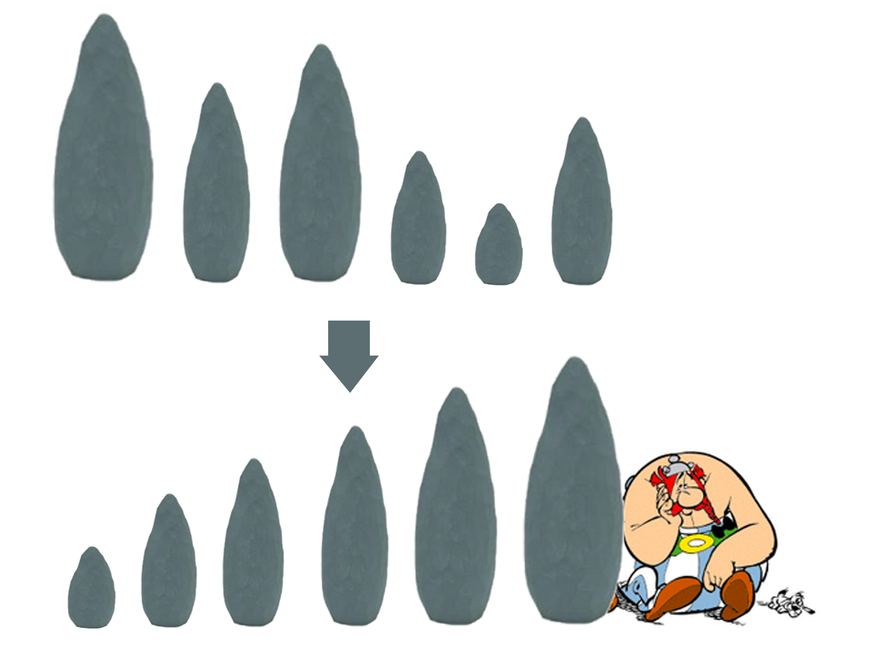
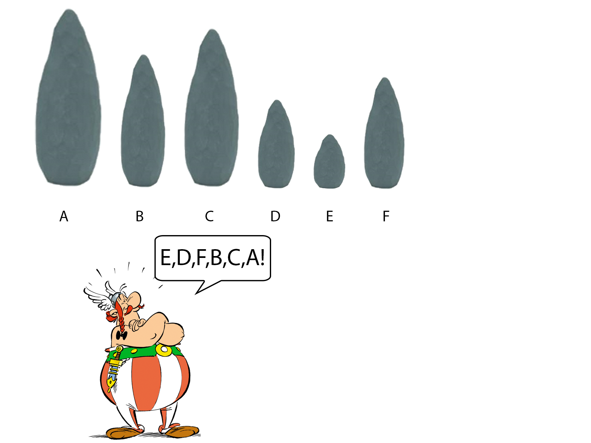

# **OO Programmeren**
Geheugenmanagement

https://apwt.gitbook.io/cursus-pro-oo/


---

# Objecten als argumenten

- Klassen zijn "gewoon" nieuwe types.
- Doorgeven als parameters in een methode.
- Verschil: **by reference**
    - Aanpassingen van object doorgegeven aan methode gebeuren ook op origineel object.

---

# Objecten als argumenten

```C#
class Meting
{
    public int Temperatuur { get; set; }
    public string OpgemetenDoor { get; set; }
}
```

---

# Objecten als argumenten

```c#
static void Main(string[] args)
{
    Meting m1 = new Meting();
    m1.Temperatuur = 26; 
    m1.OpgemetenDoor = "Elon Musk";
    Meting m2 = new Meting();
    m2.Temperatuur = 34; 
    m2.OpgemetenDoor = "Dennis Rodman";

    ToonMetingInKleur(m1, ConsoleColor.Red);
    ToonMetingInKleur(m2, ConsoleColor.Gray);
}

static void ToonMetingInKleur (Meting inmeting, ConsoleColor kleur)
{
    Console.ForegroundColor = kleur;
    Console.WriteLine($"Temperatuur {inmeting.Temperatuur}°C werd opgemeten door {inmeting.OpgemetenDoor}");
    Console.ResetColor();
}
```

---

# Objecten in methoden aanpassen

Objecten worden altijd **by reference** doorgegeven

```C#
static void ToonMetingEnVerhoog(Meting inmeting)
{
    ToonMetingInKleur(inmeting, ConsoleColor.Green);

    inmeting.Temperatuur++;
}
```
Als we deze methode als volgt aanroepen:
```C#
Meting m1 = new Meting();
m1.Temperatuur = 26; m1.OpgemetenDoor = "Elon Musk";

ToonMetingEnVerhoog(m1);

Console.WriteLine(m1.Temperatuur);
```
---

# Objecten in methoden aanpassen

Dit is niet zo bij primitieve datatypes zoals int.

```c#
static void VerhoogGetal(int inmeting)
{
    inmeting++;
}
``` 

Dit noemt men **by value**.

---

# Delen van objecten als parameter

```c#
static double Gemiddelde(double getal1, double getal2)
{
    return (getal1 + getal2) / 2;
}
```
Je mag deze methode dus ook oproepen als volgt:

```c#
double result= Gemiddelde(m1.Temperatuur, m2.Temperatuur);
```

---
# Objecten als resultaat

Ook klassen mogen het resultaat van een methoden zijn.

```c#
static Meting GenereerRandomMeting()
{
    Meting result = new Meting();
    Random r = new Random();
    result.Temperatuur = r.Next(-100, 200);
    result.OpgemetenDoor = "Onbekend";

    return result;
}
```

```c#
Meting m3 = GenereerRandomMeting();
```
---
# Objecten als resultaat

Een resultaat van een methode kan null zijn. Dus je kan het best nakijken vooraleer je er mee werkt:

```c#
Meting m3 = GenereerRandomMeting();
if(m3 != null)
{
    ToonMetingInKleur(m3, ConsoleColor.Red);
}
```

---
# Twee soorten geheugen

- Twee soorten geheugen toegewezen dat kan gebruikt worden:
    - Het kleine, maar snelle stack geheugen
    - Het grote, maar tragere heap geheugen

- Belangrijk om te weten wat waar wordt opgeslagen.
- Twee soorten variabelen:
    - **Value types**
    - **Reference types**

---
# Geheugenmanagement in C#

|  | Value types | Reference types |
| :--- | :--- | :--- |
| Inhoud van de variabele | De eigenlijke data | Een referentie naar de eigenlijke data |
| Locatie | \(Data\) **Stack** | **Heap** \(globaal\)geheugen |
| Beginwaarde | `0`,`0.0`, `""`,`false`, etc. | `null` |
| Effect van = operator | Kopieert de actuele waarde | Kopieert het adres naar de actuele waarde |

---


---

# Waarom twee geheugens?

- Bij compileren van applicatie: hoeveel geheugen nodig? 
- Bij uitvoeren weet OS hoeveel geheugen er gereserveerd moet worden.
- Niet alles kan perfect berekend/voorspeld worden.
    - Wel mogelijk bij een int.
    - Maar wat bij string? array? 
- Heap is minder gestructureerde manier om geheugen in te nemen.

---

# Value types

- De effectieve waarden van een value type worden in de stack bewaard. 
- De 'eenvoudige' of 'primitieve' datatypes inclusief enums en structs.
    - bv: int, long, char, float, boolean,...

---
# Assignment bij value types.

Wanneer we een value-type willen kopieren dan kopieren de echte waarde:

```c#
int getal=3;
int anderGetal= getal;
```

Aanpassing van deze variabelen heeft geen effect op de andere.

---

# Value types als parameter

```c#
void DoeIets(int a)
{
    a++;
    Console.WriteLine($"In methode {a}");
}

//Elders:
int getal= 5;
DoeIets(getal);
Console.WriteLine($"Na methode {getal}");
```
**Output:**
```
In methode 6
Na methode 5
```

---

# Reference types
- Effectieve waarde van een reference type wordt in de heap bewaard.
- Een referentie of pointer wordt in de heap bewaard.
- Een pointer is een geheugen adres naar waar verwezen wordt. (bv 0XA3B3163)
- Dingen die vaak groot kunnen zijn
    - Objecten, interfaces en delegates
    - Strings
    - Arrays

---

# Waarom references types? Menhirs!


- Munteenheid van het Eiland Yap zijn 4 meter hoge stenen. 
- Betalen? Met loodzware stenen sleuren?
- Sorteren? 
- "Die steen daar boven op de berg" is nu van u.
- Ze gebruiken "references" naar objecten die ze niet willen rondsleuren.

---

# Sorteren zonder references!



---

# Sorteren met references!



---
# Assignment bij reference types.

- Bij de = operator kopieren we de referentie naar de waarde.

---
# Wat doet new eigenlijk?

```c#
Student stud= new Student();
```

1. new roept de constructor van student aan. Er wordt geheugen vrijgemaakt in de heap en locatie wordt terug gegeven
2. Een variabele stud zal in de stack gemaakt worden.
3. De geheugenlocatie wordt in stud opgeslagen.
---

# Reference types met arrays

- Hetzelfde geldt voor arrays

```c#
int[] nummers= {4,5,10};
int[] andereNummers= nummers;
```

```c#
andereNummers[0]=999;
Console.WriteLine(andereNummers[0]);
Console.WriteLine(nummers[0]);
```

**Wat zal de output zijn?**

---

# References veranderen

```c#
Student a= new Student("Abba");
Student b= new Student("Queen");
a=b;
Console.WriteLine(a.Naam);
```

a en b zullen allebij naar dezelfde object in de heap verwijzen.

**Wat is de output?**

---

# Methoden en reference parameters

```c#
void DoeIets(int[] a)
{
   a[0]++;
   Console.WriteLine($"In methode {a[0]}");
}

//Elders:
int[] getallen= {5,3,2};
DoeIets(getallen);
Console.WriteLine($"Na methode {getallen[0]}");
```

**Wat is de output?**

---

```c#
void DoeIets(int a)
{
    a++;
    Console.WriteLine($"In methode {a}");
}

//Elders:
int[] getallen= {5,3,2};
DoeIets(getallen[0]); //<= VALUE TYPE!
Console.WriteLine($"Na methode {getallen[0]}");
```

**Wat is de output?**

---

# Garbage collector 
- Zorgt ervoor dat we geen geheugen voor niets gereserveerd houden
- Doorloopt geregeld het heap geheugen.
- Verwijderd data waar geen references meer naar zijn.

**bijvoorbeeld:**
```c#
int[] array1= {1,2,3};
int[] array2= {3,4,5};
array2=array1;
```
- Geen referentie meer naar {3,4,5}.
    - GC zal deze data verwijderen.

---

# Garbage collector

**Wil je niet dat de garbage collector data verwijderd?**
Maak een referentie op de stack naar dat geheugen.
```
int[] array1= {1,2,3};
int[] array2= {3,4,5};
int[] bewaarArray= array2;
array2=array;
```

---

# NullReferenceException

```c#
Student stud1;
stud1.Naam= "Test";
```

- Stud1 bevat geen referentie object in geheugen. 
- Bevat eigenlijk de waarde **null**.
- Als je de property Naam er op benaderd:
    **- NullReferenceException!**
- Visual Studio zal dit zelfs niet toestaan

    ```c#
    Student stud1 = null;
    stud1.Naam= "Test";
    ```

---

# NullReferenceException

```c#
Student stud1 = null;

Console.WriteLine(stud1.Name);
```


---

# Hoe NullReferenceException voorkomen?

```c#
if(stud1 == null)
    Console.WriteLine("oei. object bestaat niet")
```

---
# Return null

- Methoden mogen null teruggeven.

    ```c#
    static Student ZoekStudent(Student[] array, string naam)
    {
        for (int i = 0; i < array.Length; i++)
        {
            if (array[i].Name == naam)
                return array[i];
        }

        return null;
    }
    ```
